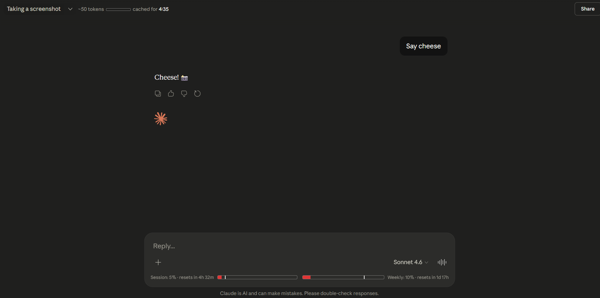

# Claude Pulse ✳️

A minimal browser extension that shows **token count**, **cache timer**, and **session/weekly usage bars** directly inside [claude.ai](https://claude.ai)'s input box — no floating widgets, no popups.

## Features

- **Token count** — Approximate token count for the current conversation, with a mini progress bar against the 200k context limit
- **Cache timer** — Countdown showing how long the conversation remains cached (cheaper to continue)
- **Usage bars** — Session (5h) and weekly (7d) usage bars injected inline into Claude's native UI, with reset countdowns (more accurate than the rounded /usage page)

## Installation

### Chrome / Edge / Brave / Chromium

1. Download [`claude-pulse-1.0.0.zip`](../../releases/download/v1.0.0/claude-pulse-1.0.0.zip)
2. Go to `chrome://extensions` and enable **Developer mode** (top-right toggle)
3. Drag and drop the zip onto the page
(Incase of any error try turning Developer mode on in extension section)

### Firefox

1. Download [`claude-pulse-1.0.0.zip`](../../releases/download/v1.0.0/claude-pulse-1.0.0.zip)
2. Go to `about:debugging#/runtime/this-firefox`
3. Click **Load Temporary Add-on** and select the zip

## How it works

- Injects a `<script>` into the page context to intercept `fetch` calls before any framework can wrap them
- Reads usage data from Claude's `/api/organizations/{org}/usage` endpoint
- Reads token counts and cache info from the conversation tree API
- All data stays local — nothing is sent anywhere

## Privacy

No data is collected, stored remotely, or transmitted. All state is kept in `chrome.storage.local` on your own machine.

## License

MIT
